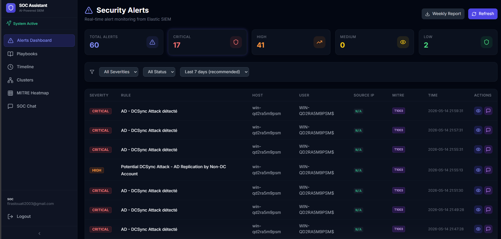
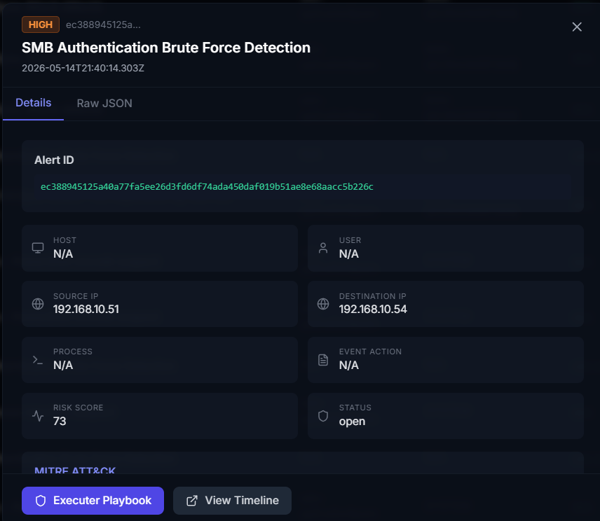
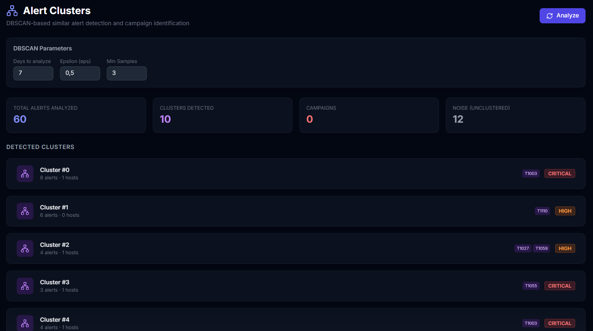
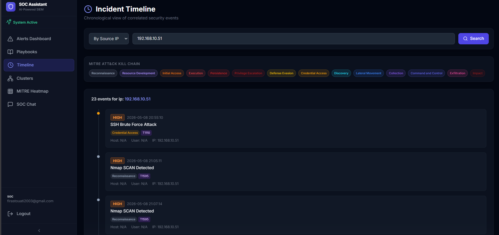
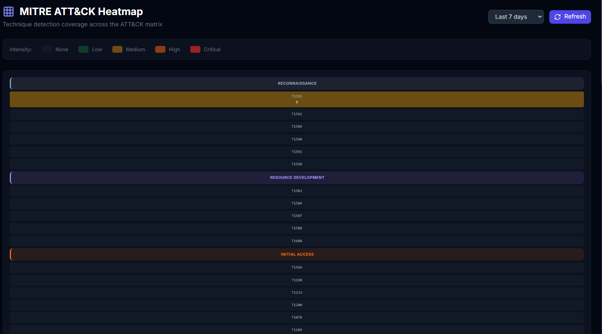
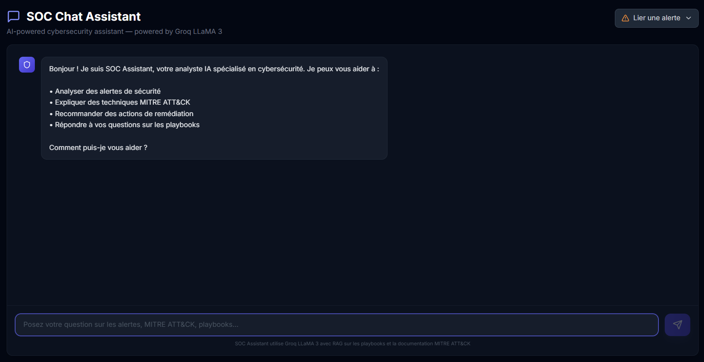
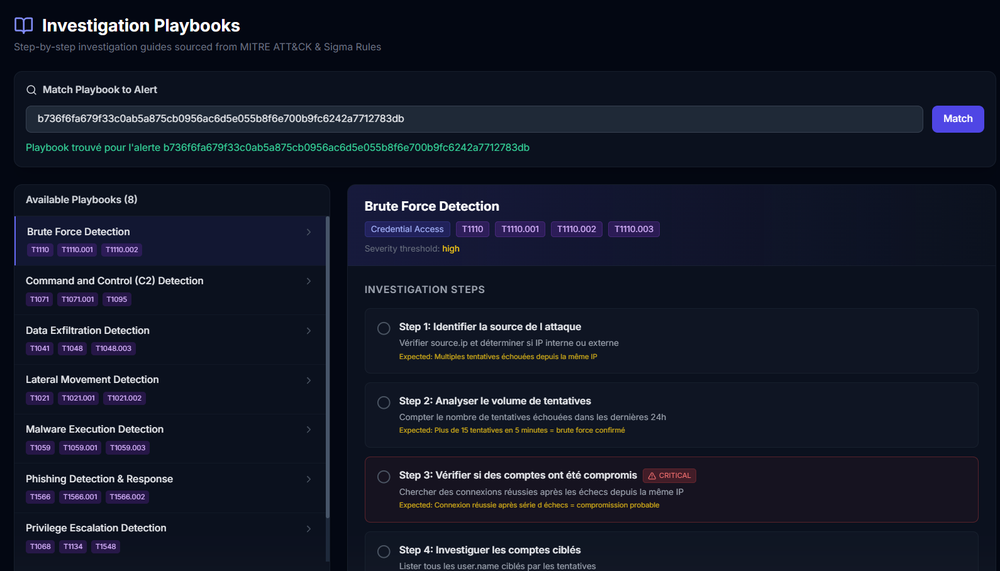
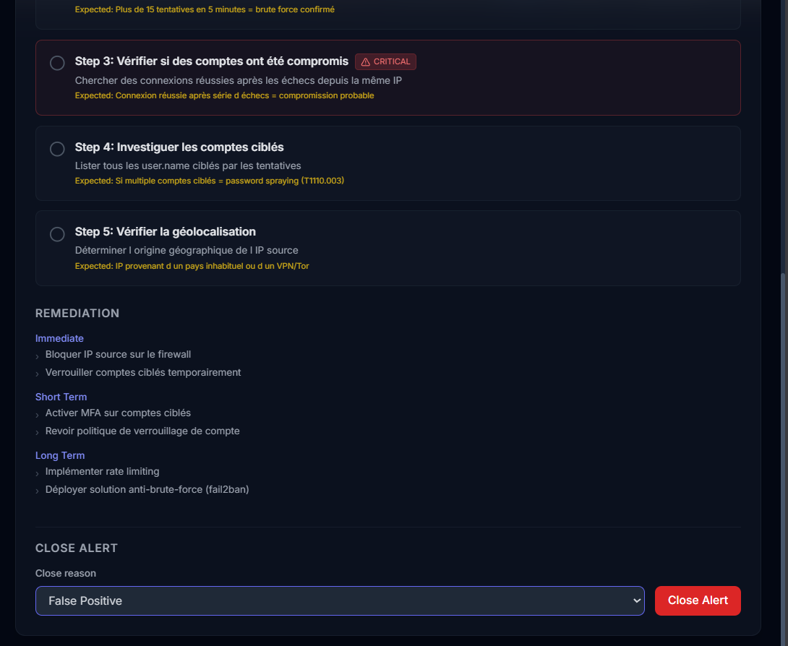

# SOC Assistant

SOC Assistant est une plateforme d’analyse SOC qui combine **Elastic Security**, **RAG**, **MITRE ATT&CK** et **Groq** pour accélérer la qualification des alertes, recommander des playbooks et générer des rapports exploitables.

## Aperçu

L’application rassemble un flux de travail orienté sécurité opérationnelle:

- ingestion et consultation d’alertes Elastic Security;
- analyse assistée par IA pour résumer et contextualiser une alerte;
- recherche de playbooks pertinents via vector search et RAG;
- clustering des alertes pour détecter des comportements similaires;
- génération de rapports et de synthèses exécutives;
- interface web React pour visualiser les alertes, timelines, clusters et recommandations.

## Captures d’écran

Les images ci-dessous proviennent du dossier `photo-app/` et illustrent les écrans principaux de l’application.

<table>
	<tr>
		<td align="center"></td>
		<td align="center"></td>
	</tr>
	<tr>
		<td align="center"></td>
		<td align="center"></td>
	</tr>
	<tr>
		<td align="center"></td>
		<td align="center"></td>
	</tr>
</table>

<table>
	<tr>
		<td align="center"></td>
		<td align="center"></td>
	</tr>
</table>

## Fonctionnalités

- Authentification basée sur Elastic.
- Tableau de bord d’alertes avec filtres et vue détaillée.
- Analyse automatique des alertes avec contexte MITRE ATT&CK.
- Playbooks de réponse stockés en YAML.
- Moteur RAG pour retrouver le playbook le plus pertinent.
- Clustering des alertes pour regrouper des incidents similaires.
- Génération de rapports pour l’exploitation opérationnelle.
- Chatbot SOC pour explorer les alertes et guider l’analyste.

## Architecture

- `backend/`: API FastAPI, logique d’analyse, intégrations Elastic et Groq, modules RAG et génération de rapports.
- `frontend/`: application React/Vite pour l’interface analyste.
- `backend/playbooks/yaml/`: base de playbooks sécurité en YAML.
- `backend/reports_output/`: sortie des rapports générés localement.

## Stack technique

- Backend: Python, FastAPI, Pydantic, Elasticsearch, Groq, RAG.
- Frontend: React, Vite, Tailwind CSS, Axios, Recharts.
- Sécurité et ops: variables d’environnement, JWT, intégration SIEM.

## Installation

### Prérequis

- Python 3.10+.
- Node.js 18+.
- Un cluster Elasticsearch accessible.
- Une clé API Groq.

### Backend

```bash
python -m venv venv
venv\Scripts\activate
pip install -r requirements.txt
```

Copiez ensuite le fichier d’exemple:

```bash
copy .env.example .env
```

Renseignez les valeurs réelles dans `.env`, puis lancez l’API:

```bash
python backend/main.py
```

### Frontend

```bash
cd frontend
npm install
npm run dev
```

## Variables d’environnement

Les secrets ne doivent jamais être commités. Utilisez `.env.example` comme base, puis créez votre `.env` local.

Variables importantes:

- `ELASTIC_URL`
- `ELASTIC_USER`
- `ELASTIC_PASSWORD`
- `ELASTIC_CA_CERT`
- `GROQ_API_KEY`
- `GROQ_MODEL`
- `VITE_API_BASE_URL` côté frontend si l’API n’est pas servie en local.

## Sécurité

- Ne poussez jamais `.env` sur GitHub.
- Utilisez `.env.example` pour documenter les variables.
- Si une clé a déjà été exposée, régénérez-la immédiatement.

## Améliorations possibles

- Ajouter des captures d’écran du dashboard.
- Déployer le frontend sur Vercel ou Netlify.
- Déployer le backend sur un serveur dédié ou un container.
- Ajouter des tests automatisés et un pipeline CI/CD.
